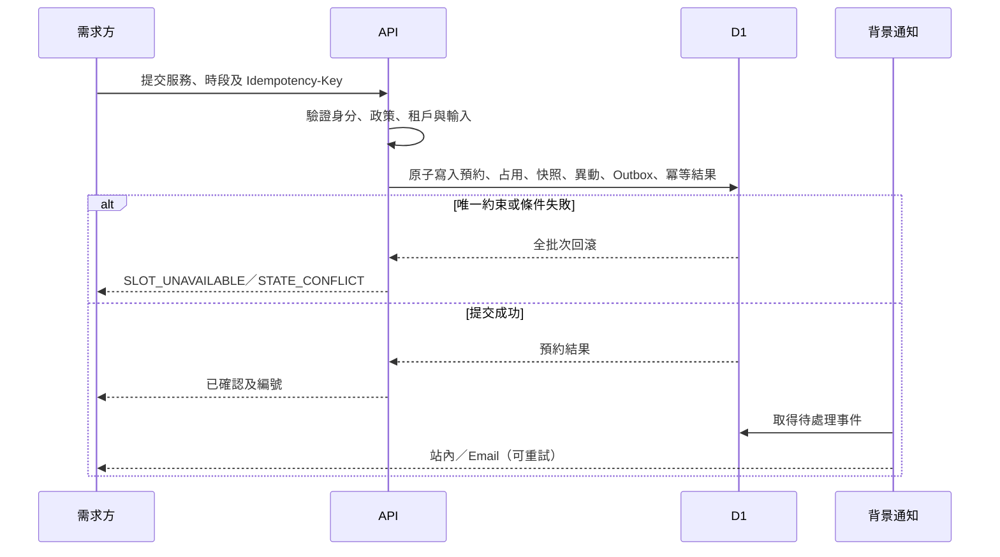

# Booking Flow

```mermaid
sequenceDiagram
    participant U as 需求方
    participant A as API
    participant D as D1
    participant N as 背景通知
    U->>A: 提交服務、時段及 Idempotency-Key
    A->>A: 驗證身分、政策、租戶與輸入
    A->>D: 原子寫入預約、占用、快照、異動、Outbox、冪等結果
    alt 唯一約束或條件失敗
      D-->>A: 全批次回滾
      A-->>U: SLOT_UNAVAILABLE／STATE_CONFLICT
    else 提交成功
      D-->>A: 預約結果
      A-->>U: 已確認及編號
      N->>D: 取得待處理事件
      N-->>U: 站內／Email（可重試）
    end
```

這是目標設計，完整預約 API 尚未實作。讀取可用時段不提供保證，寫入時資料庫唯一約束才是最後防線。相同 key 不同 request hash 應回衝突，重送相同操作回同一結果。
